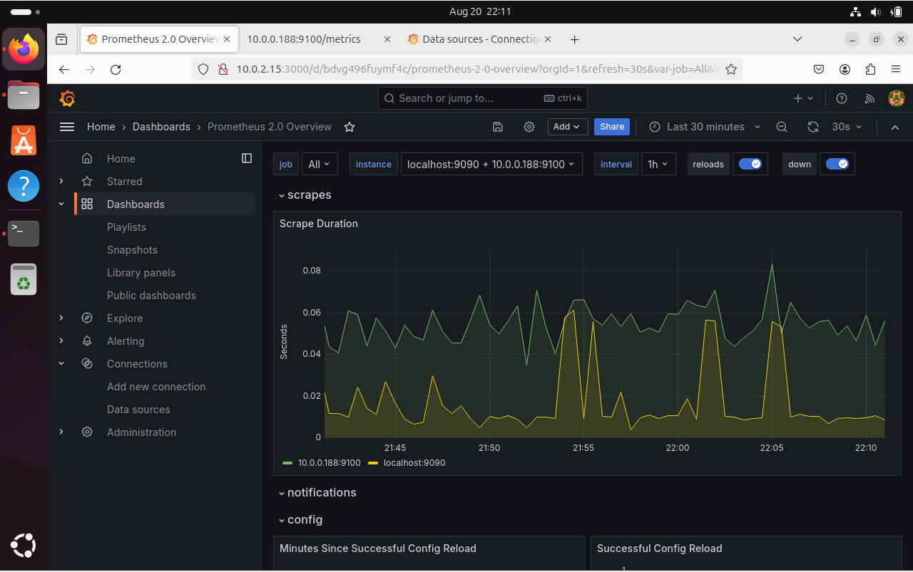
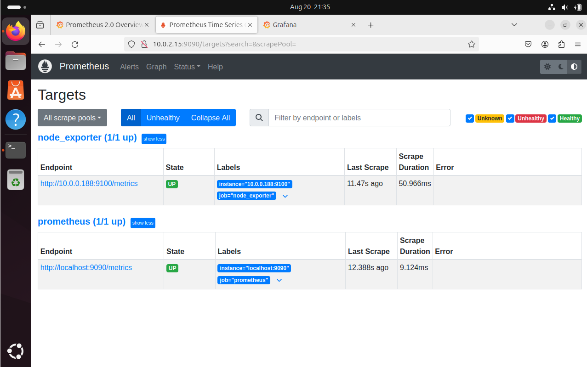
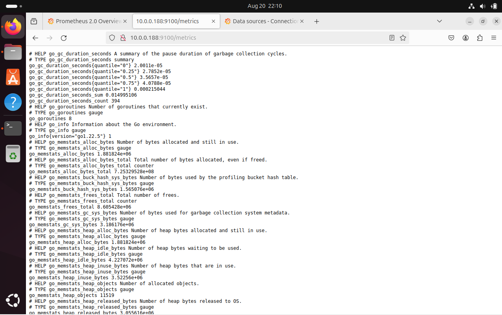

# Cloud-Based Network Monitoring and Management System

## Project Overview

This project implements a cloud-based network monitoring system using Docker, Prometheus, and Grafana. The system monitors the health and performance of networked systems, providing real-time metrics and visualization.

## Components

- **Docker**: Containerizes the Prometheus and Grafana services.
- **Prometheus**: Collects and stores metrics from the Node Exporter running on the main machine.
- **Grafana**: Visualizes metrics collected by Prometheus.

## Setup Instructions

### 1. Set Up Prometheus and Grafana on VM(I am using ubuntu)

1. **Clone the repository**:
   ```bash
   git clone https://github.com/lkumar404/Cloud-Network-Monitoring-System.git
   cd Cloud-Network-Monitoring-System
   
2. **Configure Prometheus**
   Before running Prometheus, you need to configure it to scrape metrics from both the Prometheus server itself and the Node Exporter running on your main machine.

1. **Edit `prometheus.yml`**:
    ```bash
    nano prometheus.yml
    ```
2. **Update the IP Addresses**:

    Make sure to replace `<Main-Machine-IP>` with the actual IP address of your main machine where Node Exporter is running. The file should look like this:

    ```yaml
    global:
      scrape_interval: 15s
    scrape_configs:
      - job_name: 'prometheus'
        static_configs:
          - targets: ['localhost:9090']
      - job_name: 'node_exporter'
        static_configs:
          - targets: ['<Main-Machine-IP>:9100']
    ```
   
3. **Run Docker Compose**:
    ```bash
    docker-compose up -d
    ```
    This will start Prometheus and Grafana containers.

### 2. Access Grafana and Prometheus

- **Grafana**: Open your web browser and navigate to `http://<VM1-IP>:3000` to access the Grafana dashboard.
- **Prometheus**: Open your web browser and navigate to `http://<VM1-IP>:9090` to access Prometheus.

### 3. Set Up Node Exporter on Main Machine

1. **Install Docker**:
    ```bash
    sudo apt update
    sudo apt install -y docker.io
    sudo systemctl start docker
    sudo systemctl enable docker
    ```

2. **Run Node Exporter**:
    ```bash
    docker run -d -p 9100:9100 --name node_exporter prom/node-exporter
    ```
    
## Screenshots

### Grafana Dashboard


### Prometheus Targets


### Node Exporter Metrics



## Additional Information

Add Prometheus as a Data Source in Grafana
Log in to Grafana:
Open your web browser and go to:
http://<VM1-IP>:3000 , go to data sources and 
Add a New Data Source:
Select Prometheus:
Configure Prometheus Data Source:
URL: Enter the URL where Prometheus is accessible, e.g., http://VM1ip:9090
Save and Test:

Add a dashboard and to visually see the data from both the sources. 
